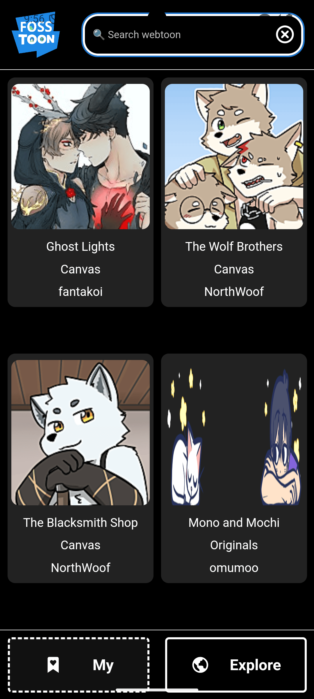
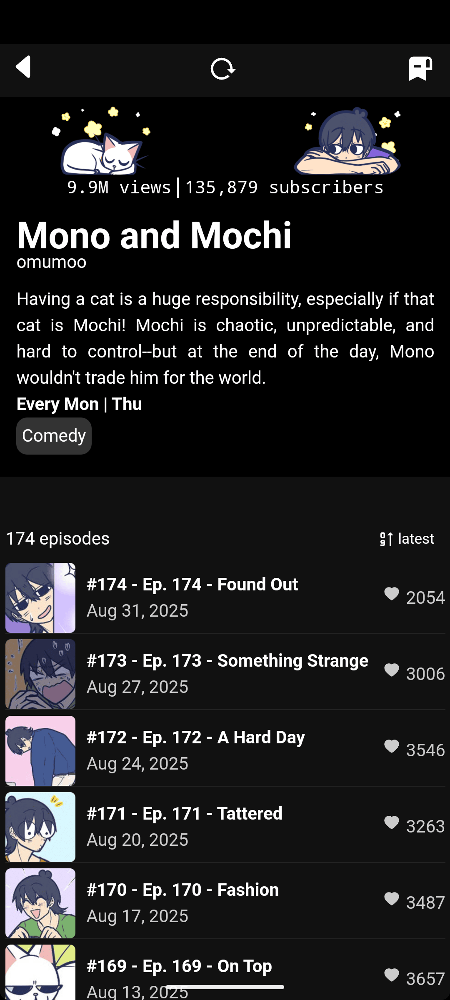
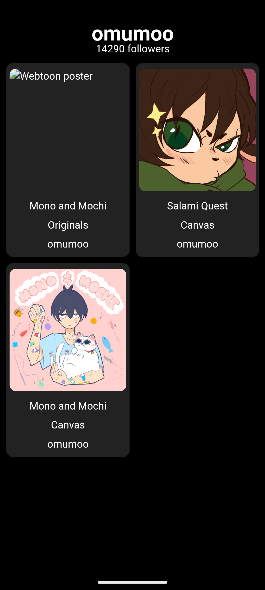

# [FOSSTOON]: An wƩbt∞n alternative client

  
  
  
  

## Purpose

1. Have fun programming in rust 🦀
2. Learn tauri mobile dev
3. Learn leptos framework and wasm frontend
4. Last but not least: stopping wƩbt∞n from tracking me on their app (╯°□°）╯︵ ┻━┻

## Disclaimer

This app is before all a side project of mine, therefore do not take it seriously.

This application is an unofficial, community‑maintained free‑and‑open‑source (FOSS) client that provides an alternative interface for accessing wƩbt∞n content. By using this software, you acknowledge that the developers and contributors assume no responsibility or liability for any issues that may arise, including service interruptions, or legal disputes. The app does not store any images.

We respect the intellectual property rights of wƩbt∞n creators and the terms of service of the official wƩbt∞n platform. This client is intended strictly for personal, non‑commercial use, and users are encouraged to support creators by accessing content through authorized channels whenever possible. Use of this software is entirely at your own risk—you assume full responsibility for complying with applicable laws, platform policies, and any consequences that may result from accessing or downloading copyrighted material.

## Limitations

Because the client operates outside the official wƩbt∞n ecosystem, certain features (such as ad‑supported episodes, log in to your account, access to full comments) may not function as intended, potentially affecting creator compensation and the overall health of the platform. Additionally, reliance on unofficial APIs could lead to sudden service disruptions if wƩbt∞n changes its backend or enforces stricter access controls. Users should remain aware that continued use may expose them to security, privacy, or legal considerations that are not covered by the official service.

## Installation

#### or install it manually:

> [Tauri prerequisites](https://tauri.app/start/prerequisites/) then [Build APK](https://tauri.app/distribute/google-play/#build-apks)

## Made with

- Elegance ans skills ✨
- Rust 🦀
- Tauri 🚀
- leptos 🏆
